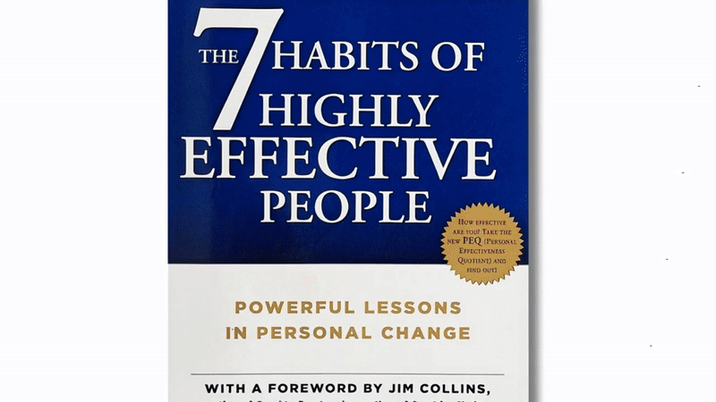
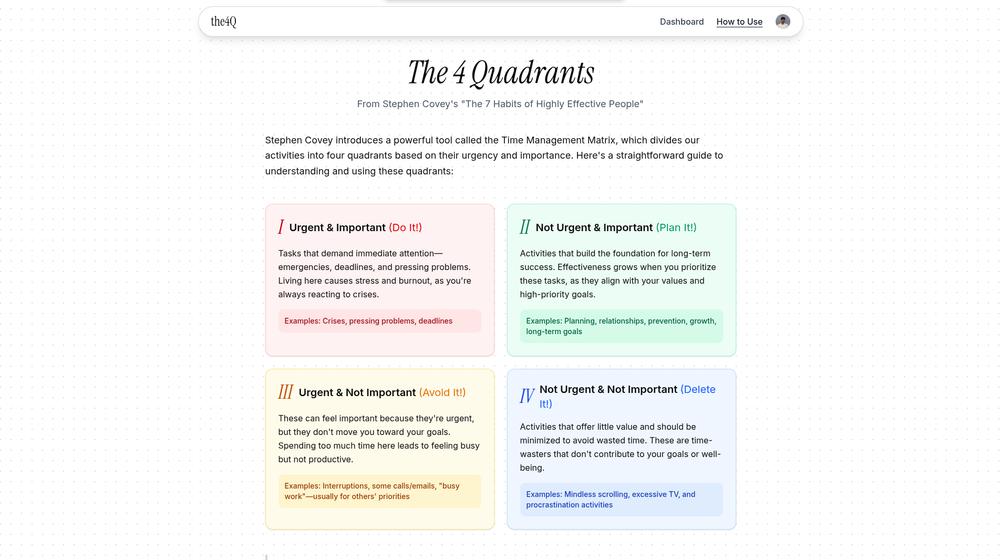
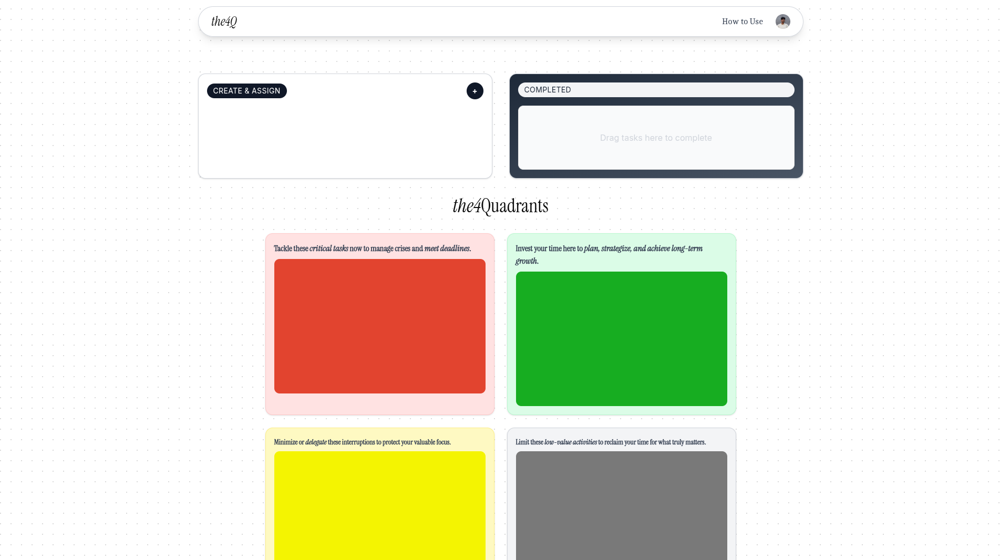

# The 4 Quadrant

A productivity application based on Stephen Covey's Time Management Matrix from "The 7 Habits of Highly Effective People."



## About

The 4 Quadrant helps you prioritize your tasks according to the principles outlined in Stephen Covey's "The 7 Habits of Highly Effective People." The application divides tasks into four quadrants based on their urgency and importance:



- **Quadrant I**: Urgent & Important (Do It!)
- **Quadrant II**: Not Urgent & Important (Plan It!)
- **Quadrant III**: Urgent & Not Important (Avoid It!)
- **Quadrant IV**: Not Urgent & Not Important (Delete It!)



## Key Features

- Create and organize tasks in the four quadrants
- Drag and drop tasks between quadrants to reprioritize
- Mark tasks as complete
- Review completed tasks to analyze productivity patterns
- Intuitive, clean user interface

## Getting Started

First, clone the repository:

```bash
git clone https://github.com/yourusername/the4quadrant.git
cd the4quadrant
```

Install dependencies:

```bash
npm install
# or
yarn install
# or
pnpm install
# or
bun install
```

Create a `.env.local` file with your environment variables (if needed).

Run the development server:

```bash
npm run dev
# or
yarn dev
# or
pnpm dev
# or
bun dev
```

Open [http://localhost:3000](http://localhost:3000) with your browser to see the result.

## Technologies Used

- [Next.js](https://nextjs.org/) - React framework
- [Tailwind CSS](https://tailwindcss.com/) - Styling
- [Supabase](https://supabase.com/) - Backend and database

## How to Contribute

1. Fork the repository
2. Create your feature branch (`git checkout -b feature/amazing-feature`)
3. Commit your changes (`git commit -m 'Add some amazing feature'`)
4. Push to the branch (`git push origin feature/amazing-feature`)
5. Open a Pull Request

## Deployment

This application can be easily deployed on [Vercel](https://vercel.com/):

```bash
npm run build
# or
yarn build
# or
pnpm build
# or
bun build
```

For more details, check out the [Next.js deployment documentation](https://nextjs.org/docs/app/building-your-application/deploying).

## Credits

- Created by [Blessing Joshua](https://github.com/blesjosh)
- Inspired by Stephen Covey's "The 7 Habits of Highly Effective People"